```mermaid
graph TD
    A[CYBERSECURITY MASTERY] --> B[1. IT FUNDAMENTALS]
    A --> C[2. SECURITY CORE]
    A --> D[3. SECURITY SERVICES]
    A --> E[4. MANAGEMENT]
    A --> F[5. SPECIALIZATIONS]
    A --> G[6. SOFT SKILLS]
    
    B --> B1[Computer Science]
    B --> B2[Networking]
    B --> B3[Operating Systems]
    B --> B4[Programming]
    B --> B5[Cloud Basics]
    
    C --> C1[Security Principles]
    C --> C2[Cryptography]
    C --> C3[Application Security]
    C --> C4[Network Security]
    C --> C5[Offensive Security]
    C --> C6[Defensive Security]
    
    D --> D1[Cloud Security]
    D --> D2[Identity Management]
    D --> D3[Testing Services]
    D --> D4[Managed Services]
    
    E --> E1[Risk Management]
    E --> E2[Compliance]
    E --> E3[Program Management]
    E --> E4[Security Awareness]
    
    F --> F1[AI/ML Security]
    F --> F2[IoT/OT Security]
    F --> F3[Blockchain]
    F --> F4[DevSecOps]
    F --> F5[Malware Analysis]
    
    G --> G1[Communication]
    G --> G2[Professional Dev]
    G --> G3[Business Skills]
```

# 🗺️ VISUAL MINDMAP & LEARNING PATH GUIDE

## 🎨 MINDMAP TỔNG QUAN - VISUAL REPRESENTATION



---

## 📊 LEARNING PATHS BY CAREER GOAL

### 🎯 PATH 1: WEB APPLICATION SECURITY SPECIALIST
**Mục tiêu**: Bug Bounty Hunter / Web Pentester
**Thời gian**: 6-8 tháng

```
LEARNING FLOW:
═══════════════════════════════════════════════════════════

[MONTH 1-2] FOUNDATIONS
    │
    ├─→ 1.2 Networking (TCP/IP, HTTP/HTTPS)
    │   └── Labs: Wireshark, curl, netcat
    │
    ├─→ 1.3 Linux Basics
    │   └── Labs: Command line, file permissions
    │
    └─→ 1.4.3 Web Technologies (HTML, JS, SQL)
        └── Labs: Build simple web app

[MONTH 3-4] WEB SECURITY CORE
    │
    ├─→ 2.3.1 OWASP Top 10 Deep Dive
    │   ├── SQL Injection (all types)
    │   ├── XSS (Reflected, Stored, DOM)
    │   ├── Authentication flaws
    │   └── Labs: DVWA, WebGoat, Juice Shop
    │
    └─→ 2.5.1 Web Penetration Testing
        ├── Burp Suite mastery
        ├── Manual testing techniques
        └── Labs: PortSwigger Academy

[MONTH 5-6] ADVANCED & SPECIALIZATION
    │
    ├─→ 2.3.2 API Security
    │   └── Labs: REST, GraphQL testing
    │
    ├─→ 3.3.3 Bug Bounty Programs
    │   └── Real practice on HackerOne
    │
    └─→ 5.4 DevSecOps Basics
        └── CI/CD security

[MONTH 7-8] PROFESSIONAL PRACTICE
    │
    ├─→ Real bug hunting
    ├─→ CVE research
    └─→ Tool development

SKILL CHECKPOINTS:
□ 50+ PortSwigger labs completed
□ 10+ valid bugs found
□ 3+ tools developed
□ eWPT or similar cert
```

---

### 🛡️ PATH 2: SOC ANALYST / BLUE TEAM
**Mục tiêu**: Security Operations Center
**Thời gian**: 8-10 tháng

```
LEARNING FLOW:
═══════════════════════════════════════════════════════════

[MONTH 1-2] FOUNDATIONS
    │
    ├─→ 1.2 Networking (Deep understanding)
    │   └── Focus: Protocol analysis, traffic patterns
    │
    ├─→ 1.3 Windows + Linux Administration
    │   └── Focus: Logs, services, processes
    │
    └─→ 1.4.1 Python for Automation
        └── Focus: Log parsing, alert automation

[MONTH 3-4] DEFENSIVE CORE
    │
    ├─→ 2.6.1 SOC Operations
    │   ├── Alert triage procedures
    │   ├── Incident classification
    │   └── Labs: Build home SOC lab
    │
    └─→ 2.6.2 SIEM Mastery
        ├── Splunk Fundamentals
        ├── ELK Stack setup
        └── Labs: Log analysis scenarios

[MONTH 5-6] THREAT DETECTION
    │
    ├─→ 2.6.3 Threat Hunting
    │   ├── Hypothesis development
    │   ├── MITRE ATT&CK mapping
    │   └── Labs: Hunt exercises
    │
    └─→ 2.6.4 Digital Forensics
        ├── Memory analysis
        ├── Disk forensics
        └── Labs: Volatility, Autopsy

[MONTH 7-8] ADVANCED DEFENSE
    │
    ├─→ 3.4.1 MDR Services
    ├─→ 4.1 Risk Management
    └─→ 5.5.4 Threat Intelligence

[MONTH 9-10] ENTERPRISE SECURITY
    │
    ├─→ Cloud security monitoring
    ├─→ Compliance requirements
    └─→ Incident response planning

SKILL CHECKPOINTS:
□ 100+ hours SIEM experience
□ 20+ incident investigations
□ 5+ forensics cases
□ CySA+ or GCIH cert
```

---

### ☁️ PATH 3: CLOUD SECURITY ENGINEER
**Mục tiêu**: Cloud Security / DevSecOps
**Thời gian**: 8-10 tháng

```
LEARNING FLOW:
═══════════════════════════════════════════════════════════

[MONTH 1-2] FOUNDATIONS + CLOUD
    │
    ├─→ 1.5 Cloud Computing (AWS/Azure/GCP)
    │   └── Labs: Free tier experiments
    │
    ├─→ 1.3.3 Containers & Kubernetes
    │   └── Labs: Docker, K8s basics
    │
    └─→ 1.4.1 Python + 1.4.4 Infrastructure as Code
        └── Labs: Terraform, CloudFormation

[MONTH 3-4] CLOUD SECURITY CORE
    │
    ├─→ 3.1 Cloud Security Services
    │   ├── IAM deep dive
    │   ├── Network security (VPC, SG)
    │   └── Labs: CloudGoat scenarios
    │
    └─→ 2.4.1 Network Defense in Cloud
        └── Labs: Cloud firewalls, WAF

[MONTH 5-6] DEVSECOPS
    │
    ├─→ 5.4 DevSecOps Complete
    │   ├── CI/CD security
    │   ├── SAST/DAST integration
    │   ├── Secret management
    │   └── Labs: Jenkins, GitLab CI
    │
    └─→ 5.4.3 Container & K8s Security
        ├── Image scanning
        ├── Runtime protection
        └── Labs: Kubernetes Goat

[MONTH 7-8] ADVANCED CLOUD
    │
    ├─→ Multi-cloud security
    ├─→ Serverless security
    └─→ Cloud compliance (SOC2, ISO)

[MONTH 9-10] AUTOMATION & SCALE
    │
    ├─→ Security automation
    ├─→ IaC security
    └─→ Cloud-native security

SKILL CHECKPOINTS:
□ 3 cloud platforms experience
□ 10+ IaC templates secured
□ 5+ CI/CD pipelines secured
□ AWS Security or CKS cert
```

---

### 🔴 PATH 4: PENETRATION TESTER / RED TEAM
**Mục tiêu**: Offensive Security Professional
**Thời gian**: 10-12 tháng

```
LEARNING FLOW:
═══════════════════════════════════════════════════════════

[MONTH 1-3] STRONG FOUNDATIONS
    │
    ├─→ Complete IT Fundamentals
    ├─→ Deep Linux mastery
    ├─→ Programming (Python, Bash, PowerShell)
    └─→ Networking protocols

[MONTH 4-6] OFFENSIVE CORE
    │
    ├─→ 2.5 Complete Offensive Security
    │   ├── Reconnaissance techniques
    │   ├── Scanning & enumeration
    │   ├── Exploitation (manual)
    │   └── Labs: HackTheBox, VulnHub
    │
    └─→ 2.3.1 Web Application Attacks
        └── Labs: All OWASP Top 10

[MONTH 7-9] ADVANCED EXPLOITATION
    │
    ├─→ 2.5.4 Advanced Techniques
    │   ├── Buffer overflows
    │   ├── Privilege escalation
    │   ├── Active Directory attacks
    │   └── Labs: OSCP prep boxes
    │
    └─→ 2.5.3 Red Team Operations
        ├── C2 frameworks
        ├── Social engineering
        └── Physical security

[MONTH 10-12] SPECIALIZATION
    │
    ├─→ Mobile pentesting
    ├─→ Cloud pentesting
    ├─→ IoT/Hardware hacking
    └─→ Custom exploit development

SKILL CHECKPOINTS:
□ 50+ machines pwned
□ 10+ CVEs discovered
□ Custom tools developed
□ OSCP certified
```

---

### 🤖 PATH 5: AI/ML SECURITY SPECIALIST
**Mục tiêu**: Emerging Tech Security Expert
**Thời gian**: 12-14 tháng

```
LEARNING FLOW:
═══════════════════════════════════════════════════════════

[MONTH 1-3] FOUNDATIONS + AI BASICS
    │
    ├─→ Standard IT Fundamentals
    ├─→ Python advanced (NumPy, Pandas)
    ├─→ Machine Learning basics
    └─→ Deep Learning introduction

[MONTH 4-6] AI/ML FUNDAMENTALS
    │
    ├─→ 5.1.1 AI Attack Vectors
    │   ├── Adversarial examples
    │   ├── Model poisoning
    │   └── Labs: Adversarial Robustness Toolbox
    │
    └─→ 5.1.2 Securing AI Systems
        ├── Secure ML pipelines
        └── Privacy-preserving ML

[MONTH 7-9] LLM & GENERATIVE AI
    │
    ├─→ 5.1.3 LLM Security
    │   ├── Prompt injection
    │   ├── Jailbreaking techniques
    │   └── Labs: Real LLM testing
    │
    └─→ GenAI security challenges

[MONTH 10-12] ADVANCED & RESEARCH
    │
    ├─→ Federated learning security
    ├─→ Differential privacy
    ├─→ Homomorphic encryption
    └─→ AI red teaming

[MONTH 13-14] SPECIALIZATION
    │
    ├─→ AI governance & compliance
    ├─→ AI audit methodologies
    └─→ Research & publications

SKILL CHECKPOINTS:
□ 5+ AI security tools built
□ 3+ vulnerabilities in AI systems
□ Published research/blogs
□ Speaking engagements
```

---

## 🎯 QUICK DECISION TREE

```
START: Bạn thích gì?
│
├─→ "Tôi thích tấn công/hack"
│   └─→ PATH 1 (Web) hoặc PATH 4 (Pentest)
│
├─→ "Tôi thích phòng thủ/bảo vệ"
│   └─→ PATH 2 (SOC/Blue Team)
│
├─→ "Tôi thích cloud/automation"
│   └─→ PATH 3 (Cloud/DevSecOps)
│
├─→ "Tôi thích công nghệ mới"
│   └─→ PATH 5 (AI/ML Security)
│
└─→ "Tôi chưa biết"
    └─→ Start với PATH 1 (Web) - dễ nhất
```

---

## 📚 RESOURCE MAPPING BY PATH

### 🌐 Web Security Resources
```
FREE:
├── PortSwigger Web Security Academy
├── OWASP WebGoat
├── PentesterLab (free labs)
└── YouTube: IppSec, STÖK

PAID ($20-50/month):
├── PentesterLab Pro
├── HackTheBox Academy
└── BugBounty platforms

BOOKS:
├── Web Application Hacker's Handbook
└── Real-World Bug Hunting
```

### 🛡️ Blue Team Resources
```
FREE:
├── Splunk Fundamentals
├── SANS Cyber Aces
├── CyberDefenders
└── Blue Team Labs Online (free tier)

PAID ($30-100/month):
├── Splunk training
├── SANS OnDemand
└── Cloud provider training

BOOKS:
├── Blue Team Handbook
└── Applied Incident Response
```

### ☁️ Cloud Security Resources
```
FREE:
├── AWS/Azure/GCP free tiers
├── Cloud provider documentation
├── Kubernetes docs
└── CNCF Security materials

PAID ($50-200/month):
├── Cloud Guru / Linux Academy
├── Cloud certifications
└── Lab environments

BOOKS:
├── Cloud Security Handbook
└── Kubernetes Security
```

---

## 🏆 CERTIFICATION ROADMAP BY PATH

### Certification Timeline
```
MONTH 1-3: Foundation Certs
├── CompTIA Network+
└── CompTIA Security+

MONTH 4-6: Intermediate Certs
├── Path 1: eWPT, BSCP
├── Path 2: CySA+, GCFA
├── Path 3: AWS Cloud Practitioner
├── Path 4: eJPT, PNPT
└── Path 5: AI/ML certificates

MONTH 7-12: Advanced Certs
├── Path 1: OSWE, Bug Bounty Hunter
├── Path 2: GCIH, GNFA
├── Path 3: AWS Security, CKS
├── Path 4: OSCP, OSEP
└── Path 5: Research publications

MONTH 13+: Expert Level
├── CISSP (all paths)
├── OSEE (offensive)
├── GSE (defensive)
└── Cloud architect certs
```

---

## 📊 SKILL MATRIX BY LEVEL

### 🟢 BEGINNER (0-3 months)
```
MUST HAVE:
☑ Linux command line basics
☑ TCP/IP understanding
☑ HTTP/HTTPS basics
☑ Basic scripting (Python/Bash)
☑ Security concepts (CIA triad)

PROJECTS:
☑ Setup home lab
☑ First CTF participation
☑ 10 TryHackMe rooms
☑ Blog với 5 posts
```

### 🟡 INTERMEDIATE (3-6 months)
```
MUST HAVE:
☑ Exploit basic vulnerabilities
☑ Use security tools proficiently
☑ Understand cloud basics
☑ Write security scripts
☑ Analyze security logs

PROJECTS:
☑ 20 HackTheBox machines
☑ Bug bounty participation
☑ Security tool on GitHub
☑ Technical presentations
```

### 🔴 ADVANCED (6-12 months)
```
MUST HAVE:
☑ Conduct full assessments
☑ Develop custom exploits
☑ Design security architecture
☑ Lead security projects
☑ Mentor others

PROJECTS:
☑ CVE discoveries
☑ Conference talks
☑ Open source contributions
☑ Professional certifications
```

### ⚫ EXPERT (12+ months)
```
MUST HAVE:
☑ Original research
☑ Industry recognition
☑ Thought leadership
☑ Complex problem solving
☑ Strategic planning

ACHIEVEMENTS:
☑ Published papers
☑ Speaking engagements
☑ Tool với 1000+ users
☑ Senior positions
```

---

## 💡 OPTIMIZATION TIPS BY LEARNING STYLE

### 👁️ Visual Learners
- Use mind mapping tools (XMind, MindMeister)
- Create network diagrams
- Watch video tutorials
- Use visualization tools

### 👂 Auditory Learners
- Listen to security podcasts
- Join study groups
- Explain concepts out loud
- Record your notes

### ✋ Kinesthetic Learners
- Hands-on labs first
- Build physical projects
- CTF competitions
- Break things to learn

### 📖 Reading/Writing Learners
- Take detailed notes
- Write blog posts
- Create documentation
- Read security books

---

## 🚀 30-60-90 DAY QUICK START

### 🗓️ First 30 Days
```
WEEK 1: Environment Setup
□ Install Kali Linux
□ Setup cloud accounts
□ Join communities
□ Create learning schedule

WEEK 2: Linux & Networking
□ Linux command line
□ Basic networking
□ Wireshark basics
□ First TryHackMe rooms

WEEK 3: Programming Start
□ Python basics
□ Bash scripting
□ Git/GitHub setup
□ First scripts

WEEK 4: Security Basics
□ Security principles
□ Basic vulnerabilities
□ Tool introduction
□ First CTF attempt
```

### 🗓️ Days 31-60
```
WEEK 5-6: Choose Your Path
□ Explore different areas
□ Identify interests
□ Select primary path
□ Deep dive begins

WEEK 7-8: Core Skills
□ Path-specific learning
□ Practical labs
□ Tool mastery
□ Project development
```

### 🗓️ Days 61-90
```
WEEK 9-10: Advanced Topics
□ Specialized skills
□ Complex labs
□ Real-world practice
□ Portfolio building

WEEK 11-12: Professional Prep
□ CV optimization
□ LinkedIn profile
□ Certification prep
□ Job applications
```

---

## 📈 PROGRESS TRACKING TEMPLATE

### Weekly Review
```markdown
## Week [X] Review

### Completed:
- [ ] Topics studied:
- [ ] Labs completed:
- [ ] Tools learned:
- [ ] Projects progress:

### Challenges:
- What was difficult?
- What needs review?

### Next Week:
- Priority topics:
- Lab goals:
- Project milestones:

### Notes:
```

### Monthly Assessment
```markdown
## Month [X] Assessment

### Skills Acquired:
- Technical:
- Tools:
- Concepts:

### Projects Completed:
1. 
2. 

### Certifications Progress:
- Studying for:
- Completed:

### Career Progress:
- Network growth:
- Applications sent:
- Interviews:

### Next Month Goals:
```

---

*"Choose your path wisely, but remember: all paths in cybersecurity intersect. Master one, understand all."*

**Document Version**: 1.0.0  
**Purpose**: Visual guide and path selection for cybersecurity learning
**Last Updated**: September 2025
